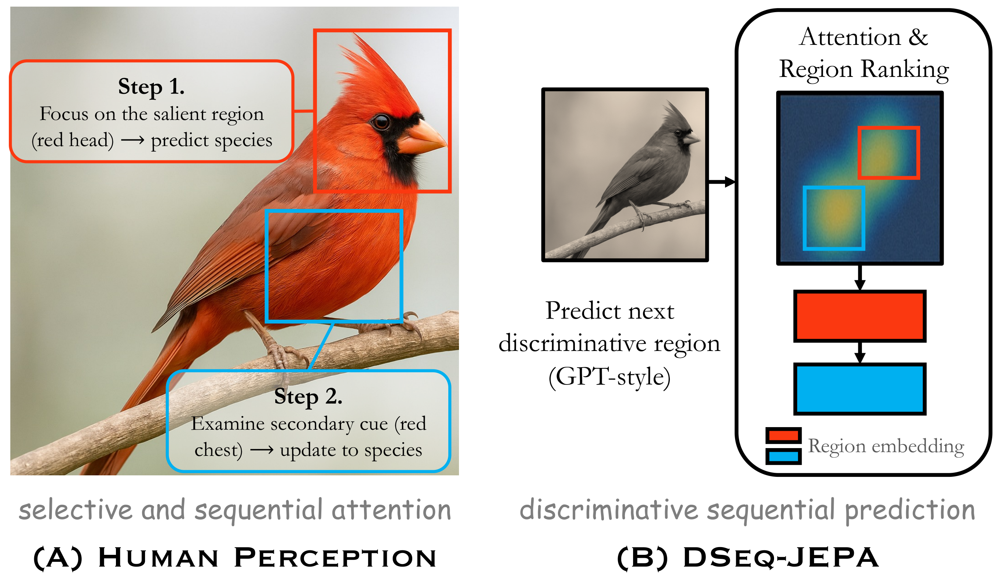

# DSeq-JEPA: Discriminative Sequential Joint-Embedding Predictive Architecture <br><sub>Official PyTorch Implementation</sub>

[](https://arxiv.org/abs/2511.17354)&nbsp;
[](https://www.alphaxiv.org/abs/2511.17354)

<p align="center">
  
</p>

This is a official PyTorch implementation of the paper [DSeq-JEPA: Discriminative Sequential Joint-Embedding Predictive Architecture](https://arxiv.org/abs/2511.17354):

```
@article{he2025dseqjepa,
      title={DSeq-JEPA: Discriminative Sequential Joint-Embedding Predictive Architecture}, 
      author={Xiangteng He and Shunsuke Sakai and Kun Yuan and Nicolas Padoy and Tatsuhito Hasegawa and Leonid Sigal},
      year={2025},
      url={https://arxiv.org/abs/2511.17354}, 
}
```

## Preparation

### Installation
Download the code:
```
git clone https://github.com/SkyShunsuke/DSeq-JEPA.git
cd DSeq-JEPA
```


Create virtual environment, then you can install the required packages with:
```
pip install -r requirements.txt
```

### Dataset
Download [ImageNet](https://www.image-net.org/download.php) dataset for pre-training and place it in the `data` directory. 

## Usage

### Pre-training
To pre-train the model, run the following command:

```
bash scripts/pretrain/pretrain_dseqjepa.sh
```
And you can change training parameters in `configs/dseqjepa/xxx.yaml` file.

### Linear Probing
To linear probe the model, run the following command:
```
bash scripts/downstream/probing.sh
```
And you can change training parameters in `configs/classification/probing.yaml` file.

## Pre-trained Models
We provide pre-trained models for accelerating reproduction process. You can download the pre-trained models from [Google Drive](https://drive.google.com/drive/folders/1x1yN5A1Hav8eUBYZEy7MWCKMiHxy1Bx4?usp=sharing).

### Contact
For any questions, please open an issue on GitHub or contact Shunsuke Sakai (sshunsuke0102@gmail.com)


