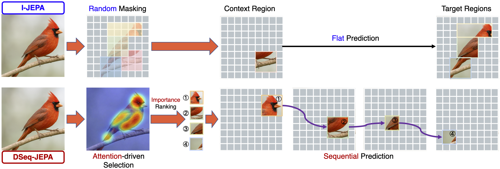

# DSeq-JEPA: Discriminative Sequential Joint-Embedding Predictive Architecture <br><sub>Official PyTorch Implementation</sub>

[](https://arxiv.org/abs/2511.17354)&nbsp;


<p align="center">
  
</p>

This is a official PyTorch implementation of the paper [DSeq-JEPA: Discriminative Sequential Joint-Embedding Predictive Architecture](https://arxiv.org/abs/2511.17354):

```
@article{he2025dseqjepa,
      title={DSeq-JEPA: Discriminative Sequential Joint-Embedding Predictive Architecture}, 
      author={Xiangteng He and Shunsuke Sakai and Shivam Chandhok and Sara Beery and Kun Yuan and Nicolas Padoy and Tatsuhito Hasegawa and Leonid Sigal},
      year={2025},
      url={https://arxiv.org/abs/2511.17354}, 
}
```

## Preparation

### Installation
Download the code:
```
git clone https://github.com/SkyShunsuke/DSeq-JEPA.git
cd DSeq-JEPA
```


Create virtual environment, then you can install the required packages with:
```
pip install -r requirements.txt
```

### Dataset
Download [ImageNet](https://www.image-net.org/download.php) dataset for pre-training and place it in the `data` directory. 

## Usage

### Pre-training
To pre-train the model, run the following command:

```
bash scripts/pretrain/pretrain_dseqjepa.sh
```
And you can change training parameters in `configs/dseqjepa/xxx.yaml` file.

### Downstream Tasks
All downstream evaluations start from a pre-training checkpoint: set
`model.pretrained_weights` in the corresponding config, and make sure
`model.use_masked_vit` / `model.use_class_token` match the pre-training config.

| Task | Datasets | Config | Script |
|---|---|---|---|
| Linear probing | ImageNet-1K | `configs/classification/probing.yaml` | `bash scripts/downstream/probing.sh` |
| Fine-grained visual categorization | iNaturalist21, CUB-200-2011, Stanford-Cars | `configs/classification/probing_{inat21,cub200,cars}.yaml` | `bash scripts/downstream/probing_fgvc.sh` |
| Detection / instance segmentation | MS-COCO 2017 | `configs/detection/coco_maskrcnn_vitb16.yaml` | `bash scripts/downstream/detection.sh` |
| Semantic segmentation | ADE20K | `configs/segmentation/ade20k_upernet_vitb16.yaml` | `bash scripts/downstream/segmentation.sh` |
| Low-level reasoning | Clevr/Count, Clevr/Dist | `configs/lowlevel/clevr_{count,dist}.yaml` | `bash scripts/downstream/clevr.sh` |
| kNN | ImageNet-1K | `configs/classification/knn.yaml` | `bash scripts/downstream/knn.sh` |

Datasets are downloaded by the helpers in `scripts/setup_data/` (`fgvc.sh`,
`inaturalist.sh`, `clervr.sh`, `coco.sh`, `ade20k.sh`) into `data/`.

#### Linear probing (ImageNet & FGVC)
A linear head with batch normalization is trained on the frozen encoder, on the
concatenated pooled features of the last four transformer blocks: SGD (momentum
0.9, Nesterov), weight decay 5e-4, 28 epochs, base learning rate 0.01 decayed at
epochs 8/16/24, batch size 32 per replica, random-resized 224 crops from
256-pixel images.  iNaturalist21, CUB-200-2011 and Stanford-Cars reuse exactly
the same protocol.

```
bash scripts/downstream/probing.sh       # ImageNet-1K
bash scripts/downstream/probing_fgvc.sh  # iNaturalist21 / CUB / Stanford-Cars
```

#### Detection and instance segmentation (MS-COCO)
Mask R-CNN with an FPN built from blocks 3, 5, 7 and 11 of the pre-trained
encoder, fine-tuned end-to-end for 25 epochs with AdamW (lr 1e-4, weight decay
0.1), linear warmup over the first epoch followed by cosine decay, global batch
size 16 and stochastic depth with a maximum drop-path rate of 0.1.  AP^box and
AP^mask are reported on `val2017`.

```
bash scripts/downstream/detection.sh
```

#### Semantic segmentation (ADE20K)
A UPerNet decoder over the feature maps of blocks 3, 5, 7 and 11, fine-tuned
with 512x512 crops using AdamW (lr 1e-4, weight decay 0.05) and a poly schedule,
and evaluated with sliding-window inference (512x512 window, stride 341x341).

```
bash scripts/downstream/segmentation.sh
```

#### Low-level reasoning (Clevr/Count, Clevr/Dist)
The target encoder is frozen and a task-specific linear classifier is trained on
the final-layer `[CLS]` token of 224x224 inputs -- 8-way for Clevr/Count and
6-way for Clevr/Dist -- with AdamW (lr 1e-3, weight decay 0.05), batch size 256
and 100 epochs with a cosine schedule, on the VTAB-1k split (800 train / 200 val
/ 15,000 test).

```
bash scripts/downstream/clevr.sh   # set CONFIG_FILE to clevr_dist.yaml for Clevr/Dist
```

## Pre-trained Models
We provide pre-trained models for accelerating reproduction process. You can download the pre-trained models from [Google Drive](https://drive.google.com/drive/folders/1a6HA5BKXohARqpP6BrRqgQhbWxyRFSJG?usp=sharing).

### Contact
For any questions, please open an issue on GitHub or contact Shunsuke Sakai (sshunsuke0102@gmail.com)


